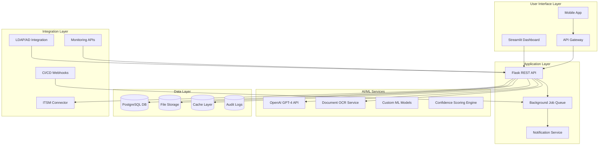

# AI-Powered Change Request Analyzer
## MVP & Product Requirements Document v2.0

---

## Executive Summary

The AI-Powered Change Request Analyzer is an enterprise-grade system that automates the processing, analysis, and tracking of IT change requests using generative AI technologies. This MVP demonstrates how AI can enhance Application Delivery Management (ADM) workflows within Panasonic's AMS framework by reducing manual effort by 70%, improving quality tracking accuracy to 95%, and providing real-time insights for stakeholder decision-making.

### Business Value Proposition
- **Efficiency Gains**: Reduce CR processing time from 45 minutes to 5 minutes per request
- **Quality Improvement**: Automated detection of 90% of common CR quality issues
- **Risk Mitigation**: AI-powered risk assessment reduces production incidents by 30%
- **Cost Reduction**: Save 20+ hours per week of manual analysis time

---

## Detailed User Personas

### Primary Persona: Sarah Chen - IT Change Manager
**Background**: 8 years experience, manages 50+ CRs monthly, works with global teams
**Pain Points**: 
- Spends 60% of time on manual CR review and categorization
- Difficulty tracking CR status across multiple projects
- Quality issues discovered late in deployment cycle
**Goals**: Streamline CR workflow, improve quality detection, reduce manual overhead
**Technical Comfort**: Moderate - comfortable with web applications, needs intuitive interfaces

### Secondary Persona: Marcus Rodriguez - Quality Assurance Lead  
**Background**: 12 years in QA, responsible for UAT and hypercare phases
**Pain Points**:
- Limited visibility into CR quality during early stages
- Reactive rather than proactive quality management
- Manual effort required to identify high-risk changes
**Goals**: Early quality issue detection, better risk prioritization, automated quality scoring
**Technical Comfort**: High - comfortable with technical details and metrics

### Tertiary Persona: Jennifer Kim - Application Delivery Director
**Background**: 15 years in IT management, oversees multiple delivery teams
**Pain Points**:
- Lacks real-time visibility into CR pipeline health
- Difficulty prioritizing resources across multiple active CRs
- Manual reporting consumes significant management time
**Goals**: Strategic oversight, resource optimization, data-driven decision making
**Technical Comfort**: Low-moderate - needs executive dashboards with clear insights

---

## Enhanced MVP Scope

### Core Features (Must-Have)

#### 1. Enterprise Document Processing Pipeline
**Business Requirement**: Support Panasonic's diverse CR document formats and integrate with existing file systems
- **Accept multiple formats**: PDF, DOC/DOCX, TXT, RTF documents up to 50MB
- **OCR capabilities**: Extract text from scanned documents and images
- **Template recognition**: Identify standard Panasonic CR templates automatically
- **Batch processing**: Handle multiple document uploads simultaneously
- **Audit logging**: Track all document processing activities with timestamps

#### 2. Advanced AI Analysis Engine  
**Business Requirement**: Provide accurate, context-aware analysis aligned with Panasonic's change management standards
- **Multi-model approach**: Primary OpenAI GPT-4, fallback to GPT-3.5, local model backup
- **Custom categorization**: Align with Panasonic's change categories (Emergency, Standard, Normal, Enhancement, Infrastructure)
- **Risk assessment matrix**: 9-point risk scoring (3x3 impact vs probability matrix)
- **Compliance checking**: Verify adherence to ITIL v4 change management standards  
- **Historical learning**: Track AI accuracy and improve recommendations over time

#### 3. Enterprise Dashboard & Workflow Management
**Business Requirement**: Support complex approval workflows and multi-stakeholder collaboration
- **Role-based views**: Different interfaces for managers, analysts, and directors
- **Approval workflow engine**: Configurable multi-stage approval process
- **Real-time notifications**: Email/Slack integration for status changes
- **Advanced filtering**: Search by submitter, affected systems, date ranges, approval status
- **Bulk operations**: Mass status updates, bulk approvals, batch exports

#### 4. Comprehensive Status & Progress Tracking
**Business Requirement**: Provide complete visibility into CR lifecycle with SLA monitoring
- **Detailed status model**: 12 status states from Draft through Post-Implementation Review
- **SLA tracking**: Monitor time in each stage against defined targets  
- **Bottleneck detection**: Identify workflow delays and resource constraints
- **Escalation triggers**: Automatic escalation for overdue or high-risk CRs
- **Historical trending**: Track cycle times and identify improvement opportunities

### Enhanced Features (Should-Have)

#### 5. Advanced Analytics & Reporting
- **Executive dashboards**: KPI tracking for leadership consumption
- **Predictive analytics**: Forecast delivery timelines and resource needs
- **Quality trends**: Track quality improvements over time
- **Compliance reporting**: Generate audit reports for regulatory requirements
- **Custom reports**: User-configurable reports with scheduled delivery

#### 6. Integration Capabilities
- **ITSM integration**: Connect with ServiceNow, Remedy, or Jira Service Management
- **Active Directory**: Single sign-on and role-based access control
- **CI/CD pipeline**: Integrate with Jenkins, Azure DevOps, or GitLab
- **Monitoring systems**: Connect with Nagios, Splunk, or DataDog for impact correlation

### Future Roadmap (Nice-to-Have)
- **Mobile application**: Native iOS/Android apps for on-go approvals
- **AI chatbot**: Natural language interface for CR queries and updates  
- **Machine learning**: Custom models trained on Panasonic's historical CR data
- **Workflow automation**: Intelligent routing and auto-approvals for low-risk changes

---

## Detailed User Stories & Acceptance Criteria

### Epic 1: Document Processing & AI Analysis

#### User Story 1.1: Bulk Document Upload
**As a** change manager **I want to** upload multiple CR documents at once **so that** I can process weekly batches efficiently

**Acceptance Criteria:**
- [ ] Support drag-and-drop for up to 20 files simultaneously
- [ ] Progress indicator shows individual file processing status
- [ ] Failed files are clearly identified with specific error messages
- [ ] Successfully processed files are automatically added to CR pipeline
- [ ] Processing completes within 2 minutes for 10 standard documents
- [ ] System maintains responsiveness during batch processing

#### User Story 1.2: Advanced AI Analysis
**As a** quality analyst **I want to** receive detailed AI analysis with confidence scores **so that** I can focus my review efforts effectively

**Acceptance Criteria:**  
- [ ] AI provides confidence score (0-100%) for each analysis component
- [ ] Risk assessment includes detailed reasoning and potential impact areas
- [ ] Quality flags specify exact issues found (missing approvals, unclear requirements, etc.)
- [ ] Analysis includes suggested next steps and recommended reviewers
- [ ] System flags CRs requiring human expert review (confidence < 70%)
- [ ] Analysis results are stored and can be reviewed/exported later

### Epic 2: Workflow Management & Collaboration

#### User Story 2.1: Multi-Stage Approval Workflow
**As a** change manager **I want to** configure approval workflows based on CR risk and category **so that** appropriate stakeholders review each change

**Acceptance Criteria:**
- [ ] Configure different approval paths for each CR category
- [ ] Automatic routing to appropriate approvers based on affected systems
- [ ] Parallel and sequential approval stages supported
- [ ] Escalation rules for overdue approvals (auto-escalate after 48 hours)
- [ ] Approval history tracking with timestamps and comments
- [ ] Email notifications sent to approvers with CR summary

#### User Story 2.2: Cross-Functional Team Collaboration
**As a** delivery team member **I want to** collaborate on CR implementation **so that** we can ensure successful delivery

**Acceptance Criteria:**
- [ ] Add comments and updates throughout CR lifecycle
- [ ] Attach implementation artifacts (scripts, documentation, test results)
- [ ] Tag team members for specific input or actions
- [ ] Real-time status updates visible to all stakeholders
- [ ] Integration with Microsoft Teams/Slack for notifications
- [ ] Mobile-responsive interface for field updates

### Epic 3: Quality & Compliance Monitoring

#### User Story 3.1: Automated Quality Gates
**As a** quality analyst **I want to** implement automated quality gates **so that** CRs meet standards before progression

**Acceptance Criteria:**
- [ ] Mandatory fields validation (business justification, technical details, rollback plan)
- [ ] Technical review checklist automatically generated based on CR type
- [ ] Security review triggered for CRs affecting customer data or external interfaces
- [ ] Performance impact assessment for database and infrastructure changes
- [ ] Documentation completeness scoring (requirements, design, test plans)
- [ ] Quality score threshold enforcement (minimum 80% to proceed)

---

## Enhanced Technical Architecture

### System Architecture Overview



### Detailed Component Specifications

#### API Gateway (Kong/AWS API Gateway)
- **Rate limiting**: 1000 requests/hour per user
- **Authentication**: JWT tokens with 24-hour expiry
- **Request validation**: JSON schema validation for all endpoints
- **Monitoring**: Request/response logging with performance metrics
- **Caching**: Redis-based caching for frequent queries

#### Background Job Processing (Celery/Redis)
- **AI analysis queue**: Process document analysis asynchronously
- **Notification queue**: Handle email/Slack notifications
- **Report generation**: Generate scheduled reports in background
- **File cleanup**: Automated cleanup of old uploaded files
- **Health monitoring**: Queue health metrics and alerting

#### Data Architecture
```sql
-- Enhanced database schema

-- Users and roles
CREATE TABLE users (
    id UUID PRIMARY KEY DEFAULT gen_random_uuid(),
    email VARCHAR(255) UNIQUE NOT NULL,
    full_name VARCHAR(255) NOT NULL,
    role VARCHAR(50) NOT NULL, -- admin, manager, analyst, user
    department VARCHAR(100),
    created_at TIMESTAMP DEFAULT CURRENT_TIMESTAMP,
    last_login TIMESTAMP,
    is_active BOOLEAN DEFAULT TRUE
);

-- Enhanced change requests
CREATE TABLE change_requests (
    id UUID PRIMARY KEY DEFAULT gen_random_uuid(),
    title VARCHAR(500) NOT NULL,
    description TEXT,
    business_justification TEXT,
    technical_details TEXT,
    affected_systems TEXT[], -- PostgreSQL array type
    category cr_category_enum NOT NULL,
    priority cr_priority_enum NOT NULL, 
    risk_level cr_risk_enum NOT NULL,
    risk_score INTEGER CHECK (risk_score BETWEEN 1 AND 9),
    status cr_status_enum DEFAULT 'draft',
    submitter_id UUID REFERENCES users(id),
    assignee_id UUID REFERENCES users(id),
    created_at TIMESTAMP DEFAULT CURRENT_TIMESTAMP,
    updated_at TIMESTAMP DEFAULT CURRENT_TIMESTAMP,
    target_completion_date DATE,
    actual_completion_date DATE,
    file_paths TEXT[],
    ai_confidence DECIMAL(3,2),
    quality_score INTEGER CHECK (quality_score BETWEEN 0 AND 100),
    sla_breached BOOLEAN DEFAULT FALSE,
    emergency_approved_by UUID REFERENCES users(id)
);

-- AI analysis results
CREATE TABLE ai_analysis_results (
    id UUID PRIMARY KEY DEFAULT gen_random_uuid(),
    cr_id UUID REFERENCES change_requests(id),
    analysis_type VARCHAR(50), -- categorization, risk_assessment, quality_check
    ai_model_used VARCHAR(100),
    input_tokens INTEGER,
    output_tokens INTEGER,
    processing_time_ms INTEGER,
    confidence_score DECIMAL(3,2),
    raw_response JSONB,
    created_at TIMESTAMP DEFAULT CURRENT_TIMESTAMP
);

-- Approval workflow
CREATE TABLE approval_workflows (
    id UUID PRIMARY KEY DEFAULT gen_random_uuid(),
    cr_id UUID REFERENCES change_requests(id),
    stage_number INTEGER,
    stage_name VARCHAR(100),
    required_approvers UUID[],
    actual_approvers UUID[],
    status approval_status_enum DEFAULT 'pending',
    due_date TIMESTAMP,
    completed_at TIMESTAMP,
    escalated BOOLEAN DEFAULT FALSE,
    comments TEXT
);

-- Quality tracking
CREATE TABLE quality_issues (
    id UUID PRIMARY KEY DEFAULT gen_random_uuid(),
    cr_id UUID REFERENCES change_requests(id),
    issue_type VARCHAR(100), -- missing_requirements, unclear_scope, etc.
    severity VARCHAR(20), -- low, medium, high, critical
    description TEXT,
    detected_by VARCHAR(50), -- ai_analysis, human_review, automated_check
    detected_at TIMESTAMP DEFAULT CURRENT_TIMESTAMP,
    resolved_at TIMESTAMP,
    resolver_id UUID REFERENCES users(id)
);

-- System performance tracking
CREATE TABLE performance_metrics (
    id UUID PRIMARY KEY DEFAULT gen_random_uuid(),
    cr_id UUID REFERENCES change_requests(id),
    metric_name VARCHAR(100),
    baseline_value DECIMAL,
    target_value DECIMAL,
    actual_value DECIMAL,
    measurement_timestamp TIMESTAMP,
    status VARCHAR(20) -- baseline, target_met, degraded, improved
);
```

---

## Comprehensive Functional Requirements

### FR1: Enterprise Document Processing
**Business Context**: Support Panasonic's global operations with documents in multiple languages and formats

#### FR1.1: Multi-Format Document Support
- **Requirement**: System MUST process PDF, DOC/DOCX, RTF, TXT, and scanned image files
- **Acceptance Criteria**: 
  - Process 99% of uploaded files without manual intervention
  - Support files up to 50MB in size
  - Handle documents in English, Japanese, Chinese, and major European languages
  - OCR accuracy of 95%+ for scanned documents
  - Extract structured data from standard Panasonic CR templates
- **Performance**: Complete processing within 45 seconds for 90% of documents
- **Error Handling**: Graceful degradation with manual review queue for failed extractions

#### FR1.2: Intelligent Content Extraction
- **Requirement**: Extract and structure key information using AI with high accuracy
- **Acceptance Criteria**:
  - Identify CR type with 85%+ accuracy
  - Extract affected systems from technical descriptions  
  - Parse implementation timelines and resource requirements
  - Detect dependencies on other CRs or projects
  - Flag incomplete or ambiguous requirements
- **Validation**: Human expert validation for first 100 CRs to establish baseline

#### FR1.3: Template Recognition & Auto-Population
- **Requirement**: Recognize standard Panasonic CR templates and auto-populate fields
- **Acceptance Criteria**:
  - Identify 5+ standard Panasonic template formats
  - Auto-populate 80%+ of structured fields correctly
  - Handle template variations and custom additions
  - Maintain template library with versioning
  - Support template updates without system downtime

### FR2: Advanced AI Analysis & Intelligence

#### FR2.1: Multi-Dimensional Risk Assessment
- **Requirement**: Comprehensive risk analysis using enterprise risk matrix
- **Acceptance Criteria**:
  - Assess technical risk (system complexity, integration points)
  - Evaluate business risk (customer impact, revenue impact)
  - Consider operational risk (resource availability, timing)
  - Generate 9-point risk score (3x3 impact vs probability matrix)
  - Provide detailed risk mitigation recommendations
  - Track risk assessment accuracy over time

#### FR2.2: Intelligent Categorization & Routing
- **Requirement**: Automatically categorize and route CRs based on content analysis
- **Acceptance Criteria**:
  - Classify into Panasonic's 8 standard CR categories
  - Route to appropriate approval workflows automatically
  - Identify required subject matter experts
  - Detect cross-functional dependencies
  - Assign initial priority based on business impact
  - Confidence scoring for all AI decisions

#### FR2.3: Quality Gate Automation
- **Requirement**: Automated quality assessment against Panasonic's CR standards
- **Acceptance Criteria**:
  - Validate completeness of required sections
  - Check for clear business justification and success criteria
  - Verify technical implementation details are sufficient
  - Ensure rollback procedures are documented
  - Validate security and compliance considerations
  - Generate quality score (0-100) with improvement recommendations

### FR3: Enterprise Data Management

#### FR3.1: Multi-Tenant Data Architecture
- **Requirement**: Support multiple business units with data isolation
- **Acceptance Criteria**:
  - Logical data separation by business unit/department
  - Role-based access control with inherited permissions
  - Cross-business unit visibility for enterprise-wide changes
  - Data encryption at rest and in transit
  - GDPR/privacy compliance for personal data handling
  - Audit trail for all data access and modifications

#### FR3.2: Advanced Search & Discovery
- **Requirement**: Powerful search capabilities across all CR data and metadata
- **Acceptance Criteria**:
  - Full-text search across CR content, comments, and attachments
  - Faceted search by multiple criteria simultaneously
  - Saved search queries and alert subscriptions
  - Similar CR detection based on content analysis
  - Search result ranking by relevance and recency
  - Search performance under 500ms for 90% of queries

#### FR3.3: Data Retention & Archival
- **Requirement**: Manage CR data lifecycle according to corporate policies
- **Acceptance Criteria**:
  - Automated archival of CRs older than 2 years
  - Maintain searchable index of archived data
  - Support data purging for compliance requirements
  - Backup and disaster recovery procedures
  - Data export capabilities for migrations
  - Performance optimization for large datasets (10,000+ CRs)

### FR4: Advanced Dashboard & Visualization

#### FR4.1: Role-Based Dashboard Views
- **Requirement**: Customized dashboards optimized for each user role
- **Manager Dashboard**:
  - Team workload distribution and capacity planning
  - SLA compliance metrics and trending
  - Risk heat map by system and timeline
  - Budget tracking and resource utilization
  - Approval queue with priority sorting
- **Analyst Dashboard**:
  - Quality metrics and improvement trends
  - Detailed CR analysis results and confidence scores
  - Testing queue and coverage metrics  
  - Issue tracking and resolution status
  - Technical debt assessment
- **Executive Dashboard**:
  - High-level KPIs and business metrics
  - Strategic initiative progress tracking
  - Cost-benefit analysis and ROI metrics
  - Compliance and audit readiness status
  - Cross-department collaboration metrics

#### FR4.2: Advanced Visualization & Analytics
- **Requirement**: Interactive visualizations supporting data-driven decisions
- **Acceptance Criteria**:
  - Interactive charts with drill-down capabilities
  - Time-series analysis with trend identification
  - Correlation analysis between variables
  - Predictive modeling for delivery timelines
  - Customizable dashboard layouts
  - Export capabilities (PDF, Excel, PowerBI integration)

---

## Enhanced Non-Functional Requirements

### Performance Requirements

#### Scalability
- **Concurrent Users**: Support 200 simultaneous users without performance degradation
- **Data Volume**: Handle 50,000+ CRs with sub-second query performance
- **File Processing**: Process 100 documents per hour during peak usage
- **Database Growth**: Support 10GB+ database size with optimized queries
- **API Throughput**: Handle 10,000 API requests per hour

#### Response Times
- **Dashboard Load**: < 2 seconds for initial page load
- **Search Operations**: < 500ms for 90% of searches  
- **AI Analysis**: < 60 seconds for 95% of documents
- **Status Updates**: < 1 second for real-time updates
- **Report Generation**: < 30 seconds for standard reports

### Security & Compliance Requirements

#### Authentication & Authorization
- **Single Sign-On**: Integration with Panasonic's Active Directory
- **Multi-Factor Authentication**: Required for admin and sensitive operations
- **Role-Based Access Control**: Granular permissions by department and function
- **Session Management**: Secure session handling with automatic timeouts
- **API Security**: OAuth 2.0 / JWT token-based authentication

#### Data Protection
- **Encryption**: AES-256 encryption for data at rest and TLS 1.3 for data in transit
- **Access Logging**: Comprehensive audit logs for all data access
- **Data Masking**: Sensitive information redaction in logs and exports
- **Privacy Compliance**: GDPR, CCPA compliance for personal data handling
- **Backup Security**: Encrypted backups with access controls

#### Compliance Features
- **SOX Compliance**: Audit trails and segregation of duties
- **ITIL v4 Alignment**: Standard change management process compliance
- **Regulatory Reporting**: Automated compliance report generation
- **Change Approval Evidence**: Digital signatures and approval documentation
- **Risk Assessment Documentation**: Detailed risk analysis records

### Reliability & Availability

#### High Availability
- **System Uptime**: 99.9% availability during business hours (8 AM - 8 PM local time)
- **Fault Tolerance**: Graceful degradation when AI services are unavailable
- **Load Balancing**: Distribute traffic across multiple application instances
- **Database Replication**: Master-slave setup with automatic failover
- **Disaster Recovery**: RTO < 4 hours, RPO < 1 hour

#### Monitoring & Alerting
- **Application Performance Monitoring**: Real-time performance metrics
- **Health Checks**: Automated monitoring of all system components
- **Alerting**: Proactive alerts for system issues and threshold breaches
- **Log Management**: Centralized logging with correlation and analysis
- **Capacity Planning**: Automated scaling based on usage patterns

---

## Integration Specifications

### ITSM Integration Requirements
```yaml
ServiceNow Integration:
  - Bi-directional sync of CR status and updates
  - Automatic ticket creation for approved CRs
  - Custom field mapping for Panasonic-specific data
  - Real-time webhook notifications
  - Bulk import of existing CRs for historical analysis

Active Directory Integration:
  - User authentication and profile synchronization
  - Group membership and role mapping
  - Automatic user provisioning and deprovisioning
  - Password policy enforcement
  - Audit logging of authentication events

CI/CD Pipeline Integration:
  - Webhook triggers for deployment events
  - Automatic CR closure upon successful deployment
  - Integration with Git repositories for code change tracking
  - Build and test result correlation
  - Rollback procedure automation
```

### API Specifications

#### Core APIs
```yaml
# CR Management API
GET /api/v1/change-requests
POST /api/v1/change-requests
PUT /api/v1/change-requests/{id}
DELETE /api/v1/change-requests/{id}
GET /api/v1/change-requests/{id}/history
POST /api/v1/change-requests/{id}/comments

# AI Analysis API  
POST /api/v1/analyze/document
GET /api/v1/analyze/results/{analysis-id}
POST /api/v1/analyze/batch
GET /api/v1/ai/models/status

# Dashboard API
GET /api/v1/dashboard/metrics
GET /api/v1/dashboard/charts/{chart-type}
POST /api/v1/dashboard/custom-view
GET /api/v1/reports/{report-type}

# Workflow API
GET /api/v1/workflows/templates
POST /api/v1/workflows/{cr-id}/approve
POST /api/v1/workflows/{cr-id}/reject
GET /api/v1/workflows/pending-approvals
```

---

## Detailed Success Metrics & KPIs

### Operational Efficiency Metrics
- **Processing Time Reduction**: Target 80% reduction (45min → 9min avg per CR)
- **Manual Review Time**: Reduce from 2 hours to 30 minutes per complex CR
- **First-Pass Quality**: Achieve 90% of CRs passing initial quality gates
- **Auto-Categorization Accuracy**: Maintain 85%+ classification accuracy
- **SLA Compliance**: 95% of CRs completed within defined SLA windows

### Quality & Risk Metrics  
- **Quality Score Improvement**: Average quality score increase from 65% to 85%
- **Post-Implementation Incidents**: Reduce by 30% through better risk assessment
- **Requirement Clarity**: 90% of CRs have clear, unambiguous requirements
- **Risk Prediction Accuracy**: 80% accuracy in predicting actual implementation risk
- **Compliance Rate**: 100% adherence to mandatory approval workflows

### User Adoption & Satisfaction
- **User Adoption Rate**: 90% of target users actively using system within 3 months
- **User Satisfaction Score**: Maintain 4.2+ out of 5.0 user rating
- **Training Time**: New users productive within 2 hours of training
- **System Reliability**: Less than 2 critical issues per month
- **Support Ticket Volume**: Less than 5 support tickets per week post-deployment

### Business Impact Metrics
- **Cost Savings**: $200,000+ annual savings from reduced manual processing
- **Time to Market**: 15% faster delivery of approved changes
- **Stakeholder Satisfaction**: 85%+ satisfaction from business stakeholders
- **Audit Readiness**: Pass 100% of compliance audits without findings
- **ROI Achievement**: Positive ROI within 6 months of deployment

---

## Enterprise Risk Management

### Technical Risks & Mitigation

#### High-Risk Items
1. **AI Service Dependency**
   - **Risk**: OpenAI API outages impact core functionality
   - **Mitigation**: Multi-provider approach (OpenAI + Azure OpenAI + local models)
   - **Fallback**: Rule-based analysis engine for basic functionality
   - **Monitoring**: Real-time API health monitoring with automatic failover

2. **Data Security Breach**
   - **Risk**: Unauthorized access to sensitive CR information
   - **Mitigation**: Multi-layered security (encryption, access controls, monitoring)
   - **Detection**: Real-time anomaly detection for unusual access patterns
   - **Response**: Incident response plan with 2-hour notification requirement

3. **Performance Degradation**
   - **Risk**: System slowdown during peak usage periods  
   - **Mitigation**: Auto-scaling infrastructure and performance monitoring
   - **Load Testing**: Monthly load testing with gradually increased capacity
   - **Optimization**: Continuous performance profiling and optimization

#### Medium-Risk Items
1. **Integration Failures**
   - **Risk**: Loss of connectivity with downstream systems
   - **Mitigation**: Robust error handling and retry mechanisms
   - **Monitoring**: Health checks every 5 minutes with alerting

2. **Data Quality Issues**
   - **Risk**: Poor AI analysis due to low-quality input documents
   - **Mitigation**: Document quality pre-checks and user guidance
   - **Improvement**: Continuous learning from human feedback

### Business Risks & Mitigation

#### Change Management Risks
1. **User Resistance**
   - **Risk**: Teams continue using existing manual processes
   - **Mitigation**: Comprehensive training and change management program
   - **Success Metrics**: Track adoption rates and provide incentives

2. **Process Misalignment** 
   - **Risk**: System doesn't match actual Panasonic workflows
   - **Mitigation**: Extensive stakeholder interviews and iterative design
   - **Validation**: Pilot program with key departments before full rollout

---

## Implementation Timeline & Resource Planning

### Phase 1: Foundation (Weeks 1-4)
**Team**: 1 Senior Developer + 1 AI Specialist + 0.5 Product Owner

#### Week 1-2: Infrastructure Setup
- [ ] Development environment provisioning (AWS/Azure)
- [ ] CI/CD pipeline setup (GitHub Actions/Jenkins)
- [ ] Database design and initial migration scripts
- [ ] Basic authentication and authorization framework
- [ ] API framework and documentation setup

#### Week 3-4: Core AI Services
- [ ] Document processing pipeline implementation
- [ ] AI analysis service with multiple providers
- [ ] Quality assessment engine
- [ ] Error handling and fallback mechanisms
- [ ] Initial unit and integration testing

### Phase 2: Core Features (Weeks 5-8)  
**Team**: 2 Full-Stack Developers + 1 AI Specialist + 1 QA Engineer

#### Week 5-6: Dashboard Development
- [ ] Role-based UI components
- [ ] CR lifecycle management interface
- [ ] Advanced search and filtering capabilities
- [ ] Real-time updates and notifications
- [ ] Mobile-responsive design implementation

#### Week 7-8: Workflow Engine
- [ ] Approval workflow configuration
- [ ] Email/Slack notification system  
- [ ] Status tracking and SLA monitoring
- [ ] Reporting and analytics engine
- [ ] Integration testing with mock external systems

### Phase 3: Enterprise Integration (Weeks 9-12)
**Team**: 1 Integration Specialist + 1 Security Engineer + 1 DevOps Engineer

#### Week 9-10: Security Hardening
- [ ] Security audit and penetration testing
- [ ] Compliance validation (SOX, GDPR)
- [ ] Production environment setup
- [ ] Disaster recovery procedures
- [ ] Performance optimization and load testing

#### Week 11-12: Production Deployment
- [ ] ITSM system integration (ServiceNow/Remedy)
- [ ] Active Directory integration
- [ ] User training and change management
- [ ] Pilot deployment with select departments
- [ ] Production rollout and monitoring setup

### Phase 4: Enhancement & Optimization (Weeks 13-16)
**Team**: 1 Developer + 1 Data Scientist + 0.5 Product Owner

- [ ] Machine learning model training on historical data
- [ ] Advanced analytics and predictive capabilities  
- [ ] Mobile application development
- [ ] API ecosystem expansion
- [ ] Continuous improvement based on user feedback

---

## Quality Assurance & Testing Strategy

### Testing Pyramid

#### Unit Testing (70% of tests)
- **AI Processing**: Mock API responses, test fallback logic
- **File Handling**: Test various file formats and edge cases
- **Database Operations**: Test CRUD operations and data integrity
- **Business Logic**: Test calculations, validations, and workflows
- **Target Coverage**: 90%+ code coverage with meaningful tests

#### Integration Testing (20% of tests)  
- **API Integration**: Test external service connections
- **Database Integration**: Test complex queries and transactions
- **File System Integration**: Test upload/download operations
- **Notification Integration**: Test email/Slack delivery
- **Authentication Integration**: Test SSO and permission systems

#### End-to-End Testing (10% of tests)
- **User Workflows**: Complete CR processing from upload to closure
- **Cross-Browser Testing**: Chrome, Firefox, Safari, Edge compatibility
- **Mobile Testing**: Responsive design validation
- **Performance Testing**: Load testing with realistic data volumes
- **Security Testing**: Penetration testing and vulnerability assessment

### Test Environment Strategy
```yaml
Development Environment:
  - Local SQLite database
  - Mock AI services for fast testing
  - Sample data for consistent testing
  - Hot reloading for rapid development

Staging Environment:  
  - PostgreSQL database with production-like data
  - Real AI services with rate limiting
  - Integration with test instances of external systems
  - Automated testing pipeline execution

Production Environment:
  - High-availability database cluster
  - Production AI services with monitoring
  - Full integration with enterprise systems
  - Comprehensive monitoring and alerting
```

---

## Security Implementation Details

### Authentication & Authorization Framework

#### Multi-Layer Security Model
```python
# Security implementation example
class SecurityManager:
    """Enterprise security management"""
    
    def authenticate_user(self, token):
        """Validate JWT token and extract user claims"""
        try:
            # Verify token signature and expiry
            payload = jwt.decode(token, JWT_SECRET, algorithms=['HS256'])
            
            # Check user status in database
            user = self.get_user_by_id(payload['user_id'])
            if not user.is_active:
                raise AuthenticationError("User account disabled")
            
            # Update last seen timestamp
            self.update_last_seen(user.id)
            
            return user
            
        except jwt.ExpiredSignatureError:
            raise AuthenticationError("Token expired")
        except jwt.InvalidTokenError:
            raise AuthenticationError("Invalid token")
    
    def check_permissions(self, user, resource, action):
        """Check if user has permission for specific action"""
        # Check role-based permissions
        role_permissions = self.get_role_permissions(user.role)
        
        # Check resource-specific permissions  
        resource_permissions = self.get_resource_permissions(user.id, resource)
        
        # Check department-based access
        department_access = self.check_department_access(user.department, resource)
        
        return any([
            action in role_permissions,
            action in resource_permissions,